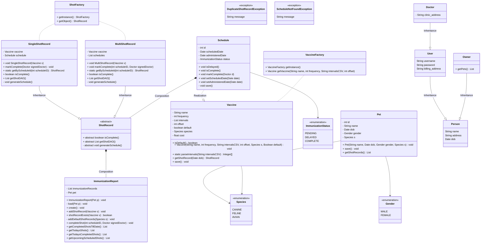
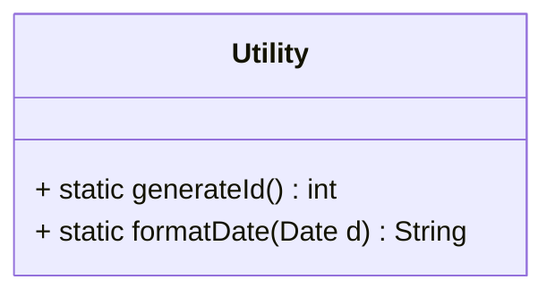
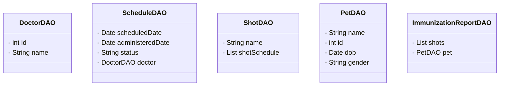

# ImmunET
Final Project for CSYE 6200 - Immunization Record Application
## Models

```mermaid
  classDiagram
    
    class ShotRecord {
      <<abstract>>
      + abstract boolean isComplete()
      + abstract List<ShotDAO> getShotDAO()
      - abstract void generateSchedule()
    }
    class VaccineFactory{
      + VaccineFactory getInstance()
      + Vaccine getVaccine(String name, int frequency, String intervalsCSV, int offset)
    }

    class ShotFactory {
      + getInstance() ShotFactory
      + getObject() ShotRecord
    }

    class Vaccine {
      - String name
      - int frequency
      - List<Integer> intervals
      - int offset
      - boolean default
      - Species species
      - float cost
      + isDefault() boolean
      + Vaccine(String name, int frequency, String intervalsCSV, int offset, Species s, Boolean default) void
      + static parseIntervals(String intervalsCSV) Integer[]
      + getShotRecord(Date dob) ShotRecord
      + save() void
    }

    class ImmunizationStatus {
      <<enumeration>>
      PENDING
      DELAYED
      COMPLETE
    }

    class Schedule {
      - int id
      - Date scheduledDate
      - Date administeredDate
      - ImmunizationStatus status
      + void isDelayed()
      + void isComplete()
      + void markComplete(Doctor d)
      + void setScheduledDate(Date date)
      + void setAdministeredDate(Date date)
      - void save()
    }

    class SingleShotRecord {
      - Vaccine vaccine
      - Schedule schedule
      + void SingleShotRecord(Vaccine v)
      + markComplete(Doctor signedDoctor) void
      + static getByScheduleId(int scheduleID) ShotRecord

      + boolean isComplete()
      + List<ShotDAO> getShotDAO()
      - void generateSchedule()
    }

    class MultiShotRecord {
      - Vaccine vaccine
      - List<Schedule> schedules
      + void MultiShotRecord(Vaccine v)
      + void markComplete(int scheduleID, Doctor signedDoctor)
      + static getByScheduleId(int scheduleID) ShotRecord

      + boolean isComplete()
      + List<ShotDAO> getShotDAO()
      - void generateSchedule()
    }
    class Gender {
      <<enumeration>>
      MALE
      FEMALE
    }

    class Species {
      <<enumeration>>
      CANINE
      FELINE
      AVIAN
    }

    class Pet {
      - int id
      - String name
      - Date dob
      - Gender gender
      - Species s
      + Pet(String name, Date dob, Gender gender, Species s) void
      + save() void
      + getShotRecords() List<ShotRecord>
    }

    class DuplicateShotRecordException {
      <<exception>>
      String message
    }
    class ScheduleNotFoundException {
      <<exception>>
      String message
    }

    class ImmunizationReport {
      - List<ShotRecord> immunizationRecords
      - Pet pet
      + ImmunizationReport(Pet p) void
      - load(Pet p) void
      + create() void
      + addShotRecord(Vaccine v) void
      + shotRecordExists(Vaccine v) boolean
      - addDefaultShotRecords(Species s) void
      + completeShot(int scheduleID, Doctor signedDoctor) void
      + getCompletedShotsTillDate() List<ShotRecord>
      + getTodaysShots() List<ShotRecord>
      + getTodaysCompletedShots() List<ShotRecord>
      + getUpcomingScheduledShots() List<ShotRecord>
    }

    class User {
      String username
      String password
      String billing_address
    }

    class Person {
      String name
      String address
      Date dob
    }

    class Owner {
      + getPets() List<Pet>
    }


    class Doctor {
      - String clinic_address
    }
    
    User --|> Person : Inheritance
    Doctor --|> User : Inheritance
    Owner --|> Person : Inheritance
    SingleShotRecord --|> ShotRecord: Inheritance
    MultiShotRecord --|> ShotRecord: Inheritance
    ShotRecord *-- ImmunizationReport : Composition
    Schedule *-- ShotRecord : Composition
    Schedule ..|> Vaccine : Realization
    Schedule --> ImmunizationStatus
    Pet --> Gender
    Pet --> Species
    Vaccine --> Species
    ShotFactory..SingleShotRecord
    ShotFactory..MultiShotRecord
    VaccineFactory..Vaccine

```

## Utility 

```mermaid
    classDiagram
    class Utility {
      + static generateId() int
      + static formatDate(Date d) String
    }
```

## DAO

```mermaid
  classDiagram
  class DoctorDAO {
      - int id 
      - String name
    }
    class ScheduleDAO {
      - Date scheduledDate
      - Date administeredDate
      - String status 
      - DoctorDAO doctor 
    }
    class ShotDAO {
      - String name
      - List<ScheduleDAO> shotSchedule
    }

    class PetDAO {
      - String name
      - int id
      - Date dob
      - String gender
    }
    class ImmunizationReportDAO {
      - List<ShotDAO> shots
      - PetDAO pet
    }
```
