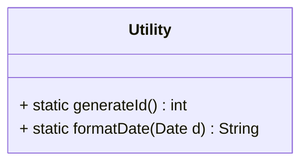

# ImmunET
Final Project for CSYE 6200 - Immunization Record Application

## ER-Diagram

## Models

```mermaid
  classDiagram
    
    class ShotRecord {
      <<abstract>>
      + abstract boolean isComplete()
      + abstract List<ShotDTO> getShotDTO()
      + abstract void generateSchedule()
    }
    class VaccineFactory {
      + getInstance() VaccineFactory
      + getVaccine(String name, int frequency, String intervalsCSV, int offset) Vaccine
    }

    class ShotFactory {
      + getInstance() ShotFactory
      + getObject() ShotRecord
    }

    class Vaccine {
      - String name
      - int frequency
      - List<Integer> intervals
      - int offset
      - boolean default
      - Species species
      - float cost
      + isDefault() boolean
      + Vaccine(String name, int frequency, String intervalsCSV, int offset, Species s, Boolean default) Vaccine
      + static parseIntervals(String intervalsCSV) Integer[]
      + getShotRecord(Date dob) ShotRecord
      + save() void
    }

    class ImmunizationStatus {
      <<enumeration>>
      PENDING
      DELAYED
      COMPLETE
    }

    class Schedule {
      - int id
      - Date scheduledDate
      - Date administeredDate
      - ImmunizationStatus status
      - Doctor doctor
      + Schedule(Date scheduledDate, Date administeredDate) Schedule
      - updateStatus() void
      + isDelayed() boolean
      + isComplete() boolean
      + markComplete(Doctor d) void
      + setScheduledDate(Date date) void
      + setAdministeredDate(Date date) void
      - save() void
    }

    class SingleShotRecord {
      - Vaccine vaccine
      - Schedule schedule
      + SingleShotRecord(Vaccine v) SingleShotRecord
      + markComplete(Doctor signedDoctor) void
      + static getByScheduleId(int scheduleID) ShotRecord

      + isComplete() boolean
      + getShotDTO() List<ShotDTO>
      - generateSchedule() void 
    }

    class MultiShotRecord {
      - Vaccine vaccine
      - List<Schedule> schedules
      + MultiShotRecord(Vaccine v) MultiShotRecord
      + markComplete(int scheduleID, Doctor signedDoctor) void
      + static getByScheduleId(int scheduleID) ShotRecord

      + isComplete() boolean
      + getShotDTO() List<ShotDTO>
      - generateSchedule() void
    }
    class Gender {
      <<enumeration>>
      MALE
      FEMALE
    }

    class Species {
      <<enumeration>>
      CANINE
      FELINE
      AVIAN
    }
    note for Pet "getShotRecords() Gives list of shot record or empty if pet immunization record already exists"
    class Pet {
      - int id
      - String name
      - Date dob
      - Gender gender
      - Species s
      + Pet(String name, Date dob, Gender gender, Species s) Pet
      + save() void
      + getShotRecords() List<ShotRecord>
    }

    class DuplicateShotRecordException {
      <<exception>>
      String message
    }
    class ScheduleNotFoundException {
      <<exception>>
      String message
    }

    class ImmunizationReport {
      - List<ShotRecord> immunizationRecords
      - Pet pet
      + ImmunizationReport(Pet p) ImmunizationReport
      - load(Pet p) void
      + create() void
      + addShotRecord(Vaccine v) void
      + shotRecordExists(Vaccine v) boolean
      - addDefaultShotRecords(Species s) void
      + completeShot(int scheduleID, Doctor signedDoctor) void
      + getCompletedShotsTillDate() List<ShotRecord>
      + getTodaysShots() List<ShotRecord>
      + getTodaysCompletedShots() List<ShotRecord>
      + getUpcomingScheduledShots() List<ShotRecord>
    }

    class User {
      # String username
      # String password
      # String billing_address
    }

    class Person {
      # String name
      # String address
      # Date dob
    }

    class Owner {
      # String name
      # String address
      # Date dob
      + Owner(name, dob, address) Owner
      + getPets() List<Pet>
    }


    class Doctor {
      # String name
      # String address
      # Date dob
      # String username
      # String password
      # String billing_address
      - String clinic_address
      - float service_cost
    }


    class BillStatus {
      <<enumeration>>
      CANCELLED
      PAID
      PENDING
    }

    class BillItemType {
      <<enumeration>>
      SERVICE
      VACCINE
    }

    class BillItemFactory {
      + getInstance() BillItemFactory
      + getItem(Doctor d) Item
      + getItem(ShotRecord s) Item
    }

    class BillItem {
      - int id
      - String name
      - float cost
      - BillItemType type
      + BillItem(String name, float cost, BillItemType type) BillItem
    }

    class Bill {
      - static final TAX_RATE
      - int id
      - User from
      - Person to
      - List<BillItem> items
      - Date billing_date
      - float tax_percent
      + getTaxInfo() TaxDTO
      + save() void
      + getSum() float
      + getTax() float
      + getSummary() BillSummaryDTO
      + Bill(List<ShotRecords> items, Doctor d, Person o) Bill
    }
    
    class BillType {
      <<enumeration>>
      DAILY
      COMPLETE
    }

    class BillFactory {
      + getInstance() BillFactory
      + getImmunizationBill(ImmunizationReport report) Bill
    }
    
    User --|> Person : Inheritance
    Doctor --|> User : Inheritance
    Owner --|> Person : Inheritance
    SingleShotRecord --|> ShotRecord: Inheritance
    MultiShotRecord --|> ShotRecord: Inheritance
    ShotRecord *-- ImmunizationReport : Composition
    Pet *-- ImmunizationReport
    Schedule *-- ShotRecord : Composition
    Schedule ..|> Vaccine : Realization
    Schedule --> ImmunizationStatus
    Pet --> Gender
    Pet --> Species
    Vaccine --> Species: Association
    ShotFactory..SingleShotRecord
    ShotFactory..MultiShotRecord
    VaccineFactory..Vaccine
    BillItemFactory..BillItem
    BillItemType --> BillItem
    BillFactory --> BillType
    Bill --> BillStatus
    BillFactory..Bill
    BillItem *-- Bill : Composition
    
```

## Utility 

## DTO

```mermaid
  classDiagram
  class DoctorDTO {
      - int id 
      - String name
    }
    class ScheduleDTO {
      - Date scheduled_date
      - Date administered_date
      - String status 
      - DoctorDTO doctor 
    }
    class ShotDTO {
      - String name
      - List<ScheduleDTO> shot_schedule
    }

    class PetDTO {
      - String name
      - int id
      - Date dob
      - String gender
    }
    class ImmunizationReportDTO {
      - List<ShotDTO> shots
      - PetDTO pet
    }
    class TaxDTO {
      - float tax_rate
      - float tax_amount
    }
    class CustomerDTO {
      - String name
      - String phone
    }
    class BillingUserDTO {
      - String name
      - String address
      - String phone
    }
    class BillItemsDTO {
      - String name
      - float price
      - String type
    }
    class BillSummaryDTO {
      - CustomerDTO customer
      - BillingUserDTO user
      - TaxDTO tax
      - List<BillItemsDTO> items
    }
```

## Documentation Helper
- Use the [MERMAID TO PNG](https://marketplace.visualstudio.com/items?itemName=LuisAlvesMartins.markdown-code-to-png) to extract the PNG (Note: It replaces the markdown with image so make sure to remove image in README.md file)
- Move the images to docs file

